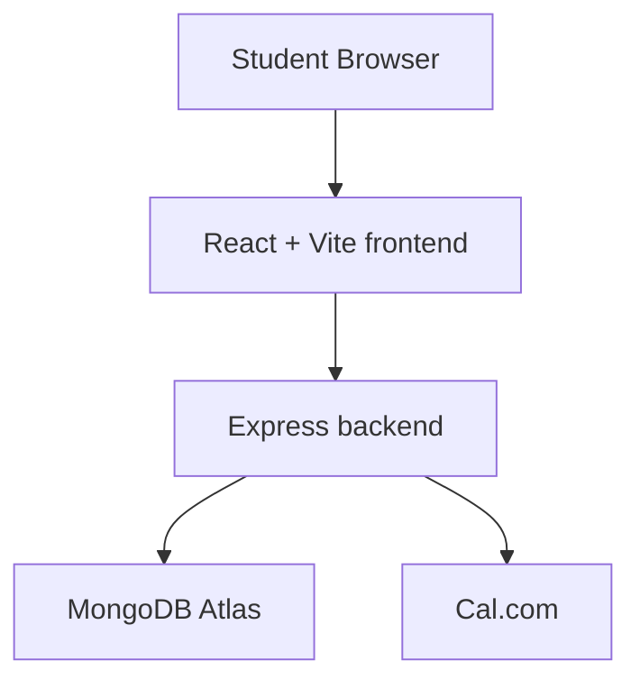
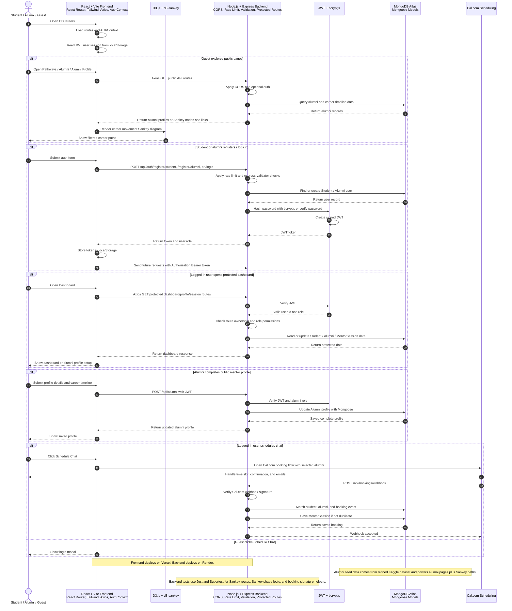
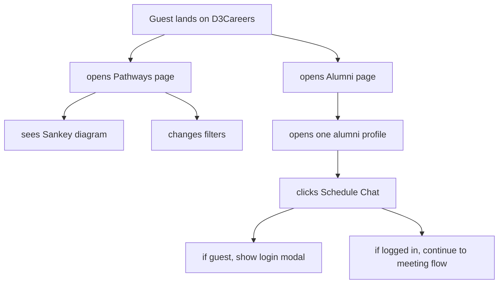
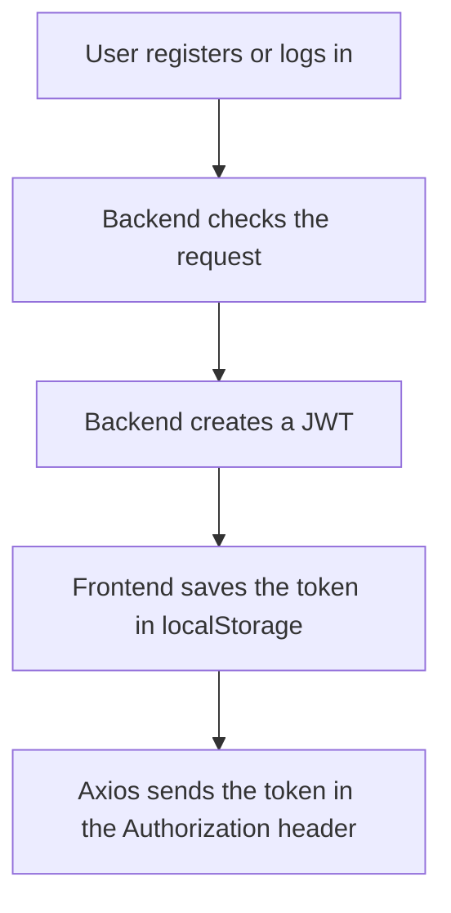
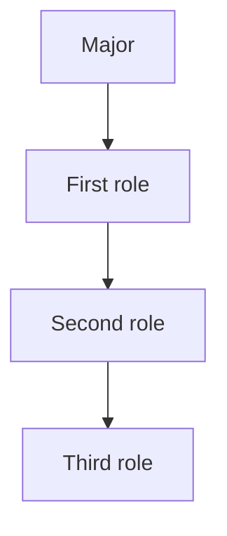
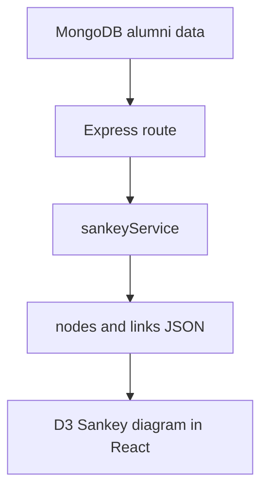
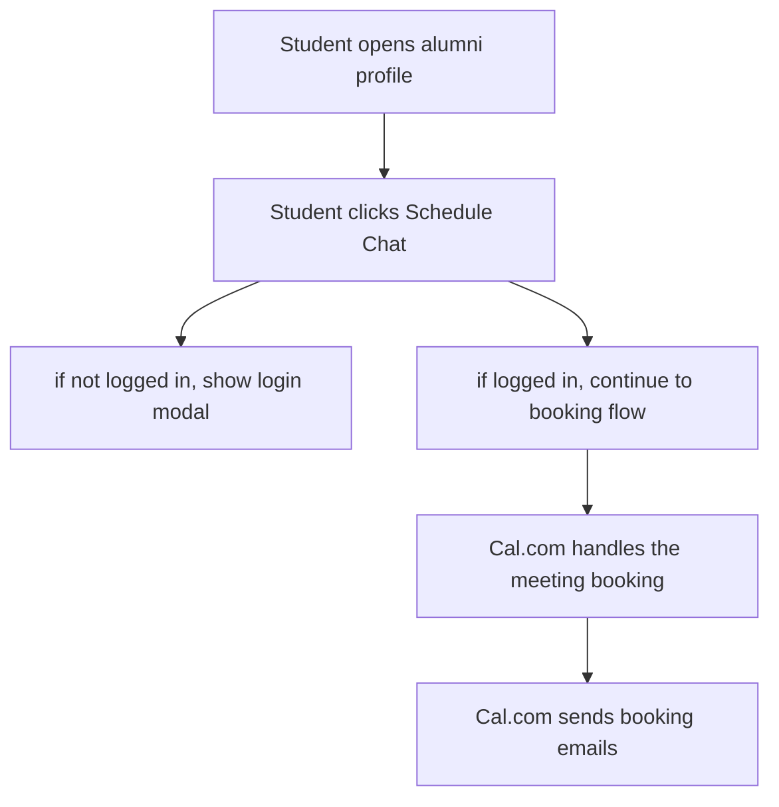

# D3Careers

D3Careers is built to help students explore real career paths and connect with alumni mentors.

The main idea is simple. A student can open the app, look at a visual career map, filter it by major and background, browse alumni profiles, and then try to schedule a chat with someone who has already walked that path.

The current data is taken from a real kaggle dataset which was further refined and can be gradually phased out by real alumni profiles once user traction catches on but as of now, any meetings booked would result in you waiting forever for the other person to come in as the alumnis are not actual users.

Built as a full stack app with React on the frontend, Node and Express on the backend, MongoDB for data, JWT for login, and Cal.com for meeting scheduling.

| Part | What I used |
|---|---|
| Frontend | React, Vite, React Router |
| Styling | Tailwind CSS, custom components |
| Data requests | Axios |
| Data visual | D3.js, d3-sankey |
| Backend | Node.js, Express |
| Database | MongoDB Atlas, Mongoose |
| Auth | JWT, bcryptjs |
| Validation | express-validator |
| Security | CORS, rate limiting, protected routes, ID checks |
| Scheduling | Cal.com |
| Testing | Jest, Supertest |
| Deployment | Vercel for frontend, Render for backend |

## What This Project Does

- shows a Sankey diagram of career movement from major to first role to later roles
- lets students filter by major, background, and path depth
- lets guests browse the Sankey diagram and alumni pages without logging in
- lets students and alumni create accounts and log in
- gives alumni a dashboard where they can complete their public mentor profile
- shows alumni profiles with timeline, skills, and advice
- uses Cal.com for scheduling meetings between students and alumni

## System Diagram Overview



## System Design Sequence Diagram



## User Flow




## Main Pages

### Home

The home page explains what D3Careers is and why it exists.

### Pathways

This is the main public page. It shows a Sankey diagram built from alumni career timeline data.

Users can filter by:

- major
- background
- depth

Depth lets the user choose how much of the path to show:

- `2` for earlier steps
- `full` for the full path stored in the data

### Alumni

This page shows alumni cards. Each card links to a full profile.

### Alumni Profile

This page shows:

- name
- major
- current role
- current company
- background tags
- bio
- career timeline
- skills
- advice

It also shows the `Schedule Chat` action.

### Dashboard

The dashboard is protected. A guest cannot open it.

Alumni use the dashboard to complete their profile. Students use the dashboard area for their own logged in experience.

## Auth And Security

I used JWT login for both students and alumni.

### How login works




### Authentication

- separate student and alumni registration routes
- password hashing with `bcryptjs`
- JWT token creation on login and register
- `AuthContext` on the frontend
- token persistence with `localStorage`
- protected dashboard route
- optional auth for public pages
- soft login gate for actions that guests should not complete

### Public routes

These pages still work for guests:

- pathways
- alumni list
- alumni profile

### Protected routes

These routes need a valid token:

- dashboard
- alumni profile completion
- student specific dashboard requests
- booking history routes

### Extra security work

Added:

- CORS setup with `CLIENT_ORIGIN`
- rate limiting on auth routes
- input validation for register routes
- ID checks so users cannot open someone else’s protected data by changing the URL

## Sankey Diagram Logic

The Sankey diagram is based on alumni career timelines stored in MongoDB.

Each alumni record has a `careerTimeline` array. I use that to build links like:




The backend does the data work and returns:

- `nodes`
- `links`

Then D3 draws the diagram on the frontend.

### Sankey data flow




## Alumni Data And Kaggle Dataset

The alumni section is not random filler data.

I started with a real Kaggle careers dataset, then refined it so it would work better for this project.

What I changed:

- cleaned and shaped the data for this app
- grouped roles into more believable career paths
- added weighted paths by major
- added second and third role progressions
- added background tags like `firstGen`, `transfer`, and `international`
- turned it into a seed file for MongoDB

The seed data lives in:

- [server/scripts/RefinedKaggleDataset_800_people.json](https://github.com/PriyanArora/D3Careers/blob/74b7673f029ceeff70815d90287e18ce1cd93974/server/scripts/RefinedKaggleDataset_800_people.json)
- [server/scripts/seed.js](https://github.com/PriyanArora/D3Careers/blob/74b7673f029ceeff70815d90287e18ce1cd93974/server/scripts/seed.js)

That refined data is what fills the alumni page, alumni profiles, and Sankey diagram.

## Cal.com Scheduling

I used Cal.com as their free tier is quite generous, pretty much unlimited meetings I believe.




Why I used Cal.com:

- it handles time slots
- it handles booking emails
- it handles confirmation flow
- it keeps this project smaller and easier to manage

I also added a backend webhook route for booking events so the app can grow into a more complete meeting flow later.

Current webhook route:

- `POST /api/bookings/webhook`

## Backend Routes

### Auth

- `POST /api/auth/register/student`
- `POST /api/auth/register/alumni`
- `POST /api/auth/login`

### Alumni

- `GET /api/alumni`
- `GET /api/alumni/online`
- `GET /api/alumni/:id`
- `GET /api/alumni/:id/sessions`
- `POST /api/alumni`

### Pathways

- `GET /api/pathways/sankey`

### Students

- `GET /api/students/:id/dashboard`

### Bookings

- `GET /api/bookings/:studentId`
- `POST /api/bookings/webhook`

## Project Structure

```text
client/
  src/
    pages/
    components/
    AuthContext.jsx
    api.js

server/
  controllers/
  middleware/
  models/
  routes/
  services/
  scripts/
  __tests__/
```

## Local Setup

### 1. Install dependencies

```bash
cd server
npm install

cd ../client
npm install
```

### 2. Add env files

In `server/.env`:

```text
MONGO_URI=your_mongo_uri
PORT=5000
CLIENT_ORIGIN=http://localhost:5173
JWT_SECRET=your_jwt_secret
CAL_WEBHOOK_SECRET=your_cal_webhook_secret
```

In `client/.env`:

```text
VITE_API_URL=http://localhost:5000
```

### 3. Seed the alumni data

```bash
cd server
node scripts/seed.js
```

### 4. Run the backend

```bash
cd server
npm run dev
```

### 5. Run the frontend

```bash
cd client
npm run dev
```

## Tests

I added tests for the parts that mattered most early on.

Current test areas include:

- Sankey shape building
- Sankey route behavior
- booking signature helper

Run backend tests with:

```bash
cd server
npm test
```

## What I Built In Plain Words

I built a career exploration app for students. The main page shows real career movement based on alumni data. Students can filter the data, read alumni stories but to schedule a chat or set up their profile, they would have to register themselves and login. Alumni follow the same route and can complete a profile and show their path publicly once account has been setup and a minimum of one carrer path has been filled on their profile. I used Cal.com for scheduling as it is way more efficient than building a scheduling system on my own which was not my goal and as their free tier was more than enough for a project of this scale.

## Future improvements

I have reached my utmost saturation for building this project but here are the plans I had for it to take it further than the exisiting application, some of which I have already implemented in the backend waiting to be finished. Feel free to fork it and experiment:

- Finish the Cal.com webhook flow already half way made so every real booking creates a MentorSession record in MongoDB
- Add SendGrid email notifications so alumni and students get app controlled booking updates, not just Cal.com emails
- Replace placeholder booking and session routes with real saved meeting history from the database
- Add stronger logging around webhook failures so it is easier to debug missing bookings in production
- Improve the booking flow by passing the selected alumni identity cleanly from the profile page into the webhook result
- Add more backend tests for live booking edge cases like duplicate webhooks, missing fields, and failed lookups
- Profile setup including university name, major, year, etc for students. Profile setup currently is only enabled for alumnis but nothing exists for the students which is something that can be built further. 

## Notes

- The Sankey diagram is meant to be the front door, so guests can use it without logging in
- JWT is used for login and protected routes
- alumni data comes from a real Kaggle dataset that I cleaned and refined
- Cal.com is the scheduling tool for meetings between students and alumnus
